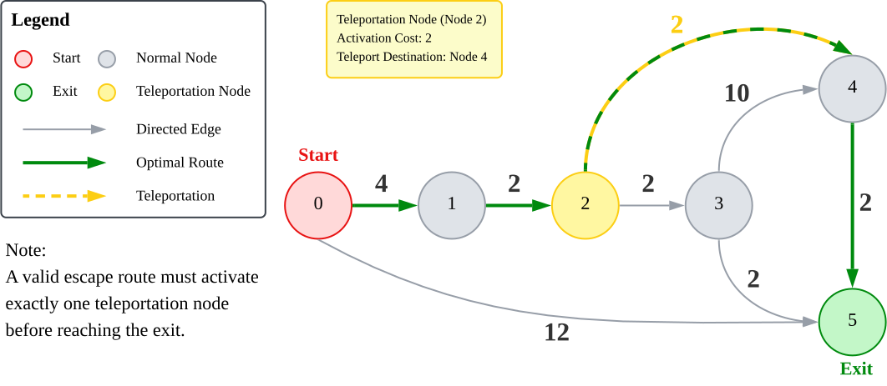

# Graph-Based Escape Route Optimizer

A Python implementation of a graph-based shortest path optimisation engine that computes the optimal escape route using Dijkstra's shortest path algorithm. The project features custom graph data structures, a binary min-heap priority queue, and efficient path reconstruction.

---

## Overview
This project models a weighted directed graph representing a forest escape scenario. Given a starting location, multiple possible exits, and special intermediate nodes (teleportation nodes), the algorithm computes the minimum-cost escape route while satisfying all problem constraints.

Unlike a conventional shortest-path problem, a valid escape requires activating exactly one teleportation node before reaching an exit. Activating a teleportation node incurs an additional cost and immediately transfers the traveller to another location, introducing a state transition that must be considered during pathfinding.

The primary challenge of this project lies in modelling these constraints rather than implementing Dijkstra's algorithm itself. By representing teleportation as additional graph transitions, the constrained escape problem can be solved using a standard shortest-path algorithm while preserving an overall time complexity of **O(E log V)**.
---

## Example Graph



**Figure 1.** Example directed weighted graph illustrating how the algorithm computes the shortest valid escape route by activating one teleportation node before reaching the exit.

---

## Features

- Weighted directed graph implemented using adjacency lists
- Custom `Graph`, `Vertex`, `Edge`, and `MinHeap` data structures
- Dijkstra's shortest path algorithm
- Efficient shortest-path reconstruction
- Support for teleportation nodes with additional traversal constraints
- Modular object-oriented architecture

---

## Technologies

- Python
- Graph Theory
- Dijkstra's Algorithm
- Binary Min Heap
- Object-Oriented Programming (OOP)

---

## Time Complexity

Let **V** denote the number of vertices and **E** denote the number of edges.

| Operation | Complexity |
| :--- | :---: |
| Graph Construction | **O(V + E)** |
| Dijkstra's Algorithm | **O(E log V)** |
| Space Complexity | **O(V + E)** |

---

## Project Structure

```text
graph-based-escape-route-optimizer/
│
├── archive/
│   └── full_code_archieve.py
|
├── examples/
│   └── example_usage.py
│
├── images/
│   └── dijkstra_example.svg
│
├── src/
│   ├── __init__.py
│   ├── edge.py
│   ├── vertex.py
│   ├── heap.py
│   ├── graph.py
│   └── escape_route_optimizer.py
│
├── tests/
│   └── test_escape_route.py
│
├── LICENSE
├── README.md
└── .gitignore
```

---

## Assumptions

The implementation assumes the following conditions hold:

- All node identifiers referenced in `start`, `exits`, `roads`, and `teleportation_nodes` exist within the graph.
- Edge weights and teleportation activation costs are non-negative, satisfying the requirements of Dijkstra's shortest path algorithm.
- A valid escape route must activate exactly one teleportation node before reaching an exit.
- The graph is static during execution; edge weights and teleportation nodes do not change while computing the escape route.

---

## Example Usage

```python
from src import EscapeRouteOptimizer


roads = [
    (0, 1, 4),
    (0, 5, 12),
    (1, 2, 2),
    (2, 3, 2),
    (3, 4, 10),
    (3, 5, 2),
    (4, 5, 2),
]

teleportation_nodes = [
    (2, 2, 4),  # node, activation_cost, teleport_destination
]

optimizer = EscapeRouteOptimizer(roads, teleportation_nodes)

time_required, path = optimizer.escape(
    start=0,
    exits=[5],
)

print("Time required:", time_required)
print("Path:", path)
```

**Output**

```text
10
[0, 1, 2, 4, 5]
```
---

## Testing

The project includes unit tests covering representative escape scenarios, including:

- Standard shortest-path computation using the example graph
- Validation that an escape route must activate a teleportation node
- Detection of scenarios where no valid escape route exists

Run the test suite with:

```bash
python -m pytest -v
```

---

## Skills Demonstrated

- Graph modelling
- Shortest path optimisation
- Custom data structure (priority queue) implementation
- Object-oriented software engineering
- Complexity analysis
- Algorithm design

## Future Improvements

Potential extensions to this project include:

- Add input validation and descriptive exceptions for malformed graphs or invalid node identifiers.
- Support multiple teleportation node activations within a single escape route.
- Implement A* search for heuristic-based pathfinding on large-scale graphs.
- Add graph visualization to illustrate explored nodes and computed shortest paths.
- Benchmark performance against established graph libraries such as NetworkX.